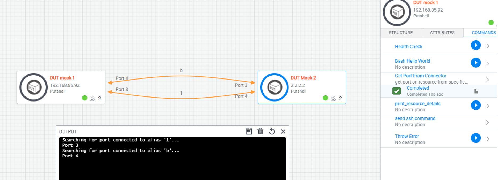

# Get Port from Connector
This is a resource script that will find port of specified connector alias

## Usage
- attach script to resource model
- define a "target_alias" input
- create connector and assign alias
- Run command, specifying target alias

### Implementation Example
